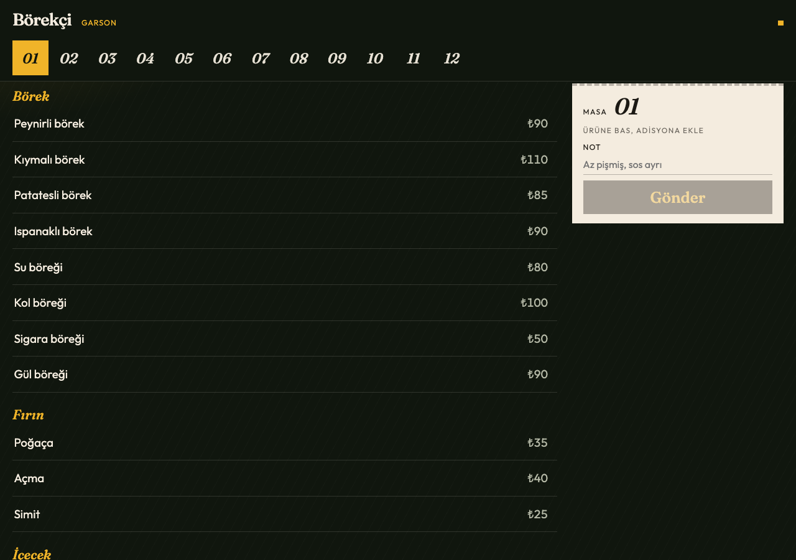
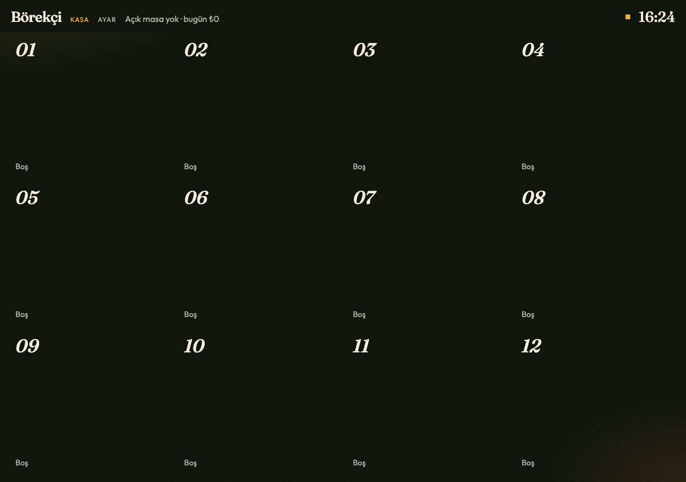
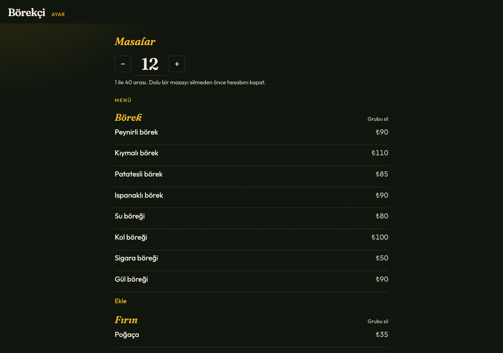

# Börekçi

Garson tableti, kasa ve menü ayarı. Garson ürüne basınca adisyon oluşur. Kasa, hangi masada ne durduğunu aynı anda görür.

A waiter tablet, a cashier board, and menu settings. Tapping a product builds the ticket. The cashier sees every open table at the same time.








## Kurulum / Setup

Ek paket yok. Node yeter. / No extra packages. Node is enough.

```bash
cd borekci
node server.js
```

Adres / Address: http://127.0.0.1:4173

- `/` tezgah / counter
- `/garson` tablet / waiter tablet
- `/kasa` açık masalar / open tables
- `/ayar` masa sayısı ve menü / table count and menu

`PORT` ortam değişkeni portu değiştirir. / The `PORT` environment variable changes the port.

## Teknoloji / Stack

Sunucu, çatısız **Node.js `http`** modülü. Sayfalar `public/` altında düz HTML, CSS ve JavaScript. Menü `data/menu.json`, günün masaları `data/state.json` dosyasında. Garson ile kasa **Server-Sent Events** (`text/event-stream`) ile bağlı kalır. Gün anahtarı `Europe/Istanbul` saatine göre değişir.

The server is the plain **Node.js `http`** module. Pages in `public/` are HTML, CSS, and JavaScript. The menu is `data/menu.json` and the day’s tables are `data/state.json`. Waiter and cashier stay connected with **Server-Sent Events** (`text/event-stream`). The day key follows `Europe/Istanbul`.
